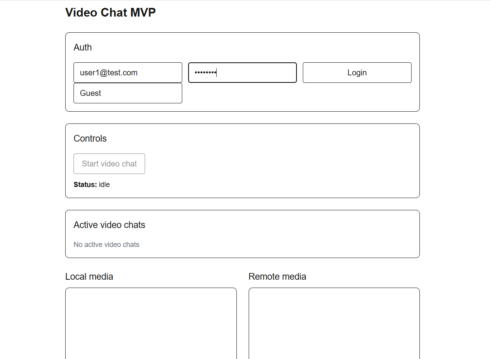
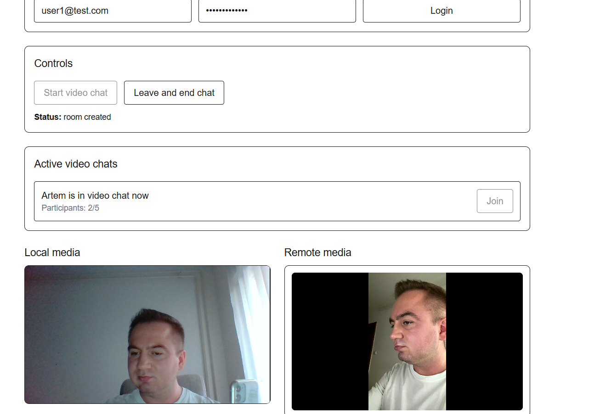

# Video Chat

A full-stack WebRTC application that enables users to create private video rooms and communicate with low latency using modern browser technologies.

The project was built to explore WebRTC architecture, LiveKit integration, TURN servers and real-time communication in modern web applications.

## Features

- Secure user authentication
- Create and join private video rooms
- Real-time audio and video communication
- Camera and microphone controls
- Responsive interface
- JWT authentication
- LiveKit integration

## Tech Stack

- Next.js
- React
- TypeScript
- Tailwind CSS
- LiveKit Client SDK

## Screenshots

### Home page



### Video Room



## Backend

The backend repository is available here:

https://github.com/harry177/video-chat-backend

## Architecture

See the backend repository for the complete architecture overview:

https://github.com/harry177/video-chat-backend/blob/main/ARCHITECTURE.md

## Running Locally

```bash
npm install
npm run dev
```

Create a `.env.local` file:

```env
NEXT_PUBLIC_API_BASE_URL=http://localhost:3001
```